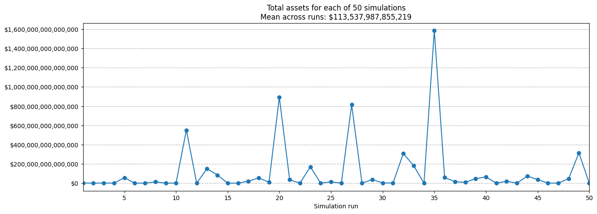

# Simulations of the Tulip Coin coding challenge

Details of the challenge are outlined below:

To run a suite of simulations:

- Define the trading strategies in the functions `implement_trading_strategy()` in the `player.py` script for the main
  and other (random) players.
- Tweak as desired the simulation parameters under the `# Define constants` sections at the top of the `simulation.py`
  script.
- Ensure the packages [pandas](https://pandas.pydata.org/) and [matplotlib](https://matplotlib.org/) are installed, and
  then run `simulation.py`.

The results shown are for the main player.

